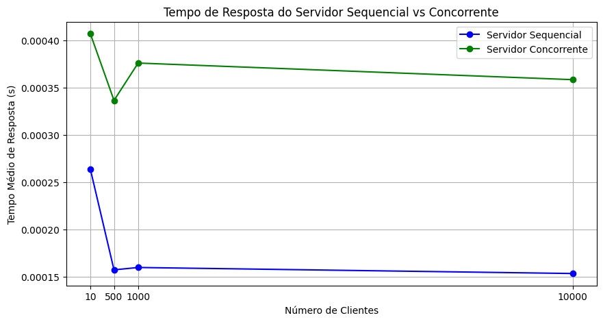
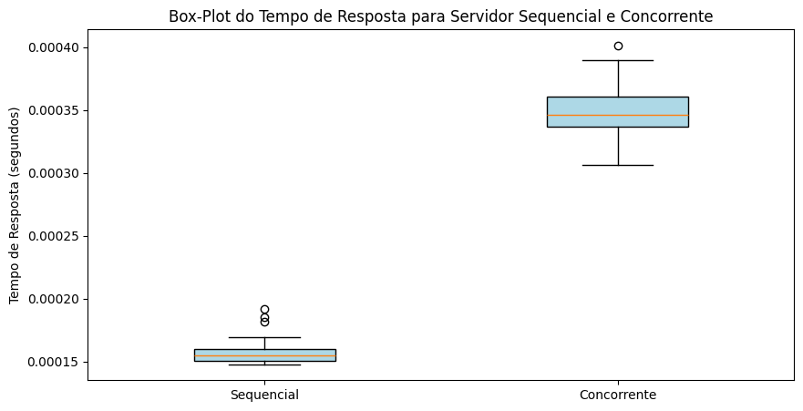

# Sistema-sockets-server-sequencial-concorrente

Este projeto implementa um servidor em Python usando Sockets que verifica se um ano é bissexto ou não. Há duas versões do servidor: **sequencial** e **concorrente**. O servidor concorrente utiliza Threads para processar múltiplas conexões ao mesmo tempo, enquanto o servidor sequencial processa uma conexão por vez.

Simula o funcionamento do servidor com 10, 100/500, 1.000 e 10.000 clientes. O tempo de resposta é coletado e comparado entre os dois tipos de servidor. Além disso, são gerados gráficos de desempenho, tanto de linha quanto box-plot, com base nas simulações.

## Funcionalidades

- **Servidor Sequencial**: Processa uma conexão de cada vez.
- **Servidor Concorrente**: Cria uma nova thread para cada cliente.
- **Cliente**: Envia um ano para o servidor e recebe a resposta se o ano é bissexto ou não.
- **Simulação de Clientes**: Simula 10, 100, 1.000 e 10.000 clientes.
- **Coleta de Tempo de Resposta**: Mede o tempo de resposta do servidor para diferentes quantidades de clientes.
- **Gerenciamento de Gráficos**: Gera gráficos de linha e box-plot para comparar o desempenho dos servidores sequencial e concorrente.

## Tecnologias Utilizadas

- **Python**: Linguagem principal para desenvolvimento.
- **Sockets**: Comunicação entre servidor e cliente.
- **Threads**: Usadas no servidor concorrente para tratamento paralelo de conexões.
- **Matplotlib**: Biblioteca para criação de gráficos.

## Estrutura do Código

O código está estruturado em funções que lidam com cada parte do processo, desde o servidor até a geração dos gráficos.

### 1. Funções Principais

- **`eh_bissexto(ano)`**: Função para verificar se o ano é bissexto.
- **`servidor_sequencial(porta)`**: Função que implementa o servidor sequencial.
- **`servidor_concorrente(porta)`**: Função que implementa o servidor concorrente.
- **`tratar_cliente(conn, addr)`**: Função que processa a conexão de um cliente em uma thread separada no servidor concorrente.
- **`cliente(ano, port)`**: Função do cliente que envia um ano e recebe a resposta do servidor.
- **`simular_clientes(num_clientes, port)`**: Função que simula múltiplos clientes se conectando ao servidor e coletando os tempos de resposta.
- **`iniciar_servidor(tipo_servidor)`**: Função que inicia o servidor sequencial ou concorrente.
- **`executar_experimentos()`**: Função que executa os experimentos para coletar os tempos de resposta dos servidores.
- **`gerar_graficos(tempos_sequencial, tempos_concorrente)`**: Função que gera gráficos de linha para comparar o desempenho dos servidores.
- **`gerar_boxplot(tempos_sequencial, tempos_concorrente)`**: Função que gera um gráfico box-plot para comparar a distribuição dos tempos de resposta.

### 2. Experimentos

O programa executa os experimentos para 10, 100, 1.000 e 10.000 clientes, repetindo 10 vezes e coletando os tempos médios de resposta dos servidores sequencial e concorrente.

#### Passos para execução:

1. **Iniciar o servidor**: O servidor pode ser sequencial ou concorrente.
2. **Simulação de clientes**: O número de clientes varia entre 10, 100, 1.000 e 10.000.
3. **Coleta de tempo de resposta**: O tempo médio de resposta é calculado para cada número de clientes.
4. **Gerar gráficos**: São gerados gráficos de linha e box-plot para comparar o desempenho dos servidores.

## Instalação

### Requisitos

- Python 3.x ou superior
- Matplotlib para visualização dos gráficos:
  
  ```bash
  pip install matplotlib
  ```

1. Clone o repositório:
  
  ```bash
  git clone git@github.com:ggomes12/Sistema-sockets-server-sequencial-concorrente.git
  cd <diretorio-do-repositorio>
  ```
2. Execute o código:
```bash
  python3 servidores_seq_conc.py
```
3. Os resultados serão exibidos nos gráficos gerados, mostrando a comparação de desempenho entre os servidores sequencial e concorrente.


### Exemplo de Saída

Ao rodar o código, você verá algo como o seguinte no terminal:

```
  Servidor sequencial aguardando conexões em 127.0.0.1:15000
  Tempos servidor sequencial (10 clientes): 0.0023 segundos
  Servidor concorrente aguardando conexões em 127.0.0.1:15001
  Tempos servidor concorrente (10 clientes): 0.0019 segundos
```

Além disso, gráficos de linha e box-plot serão gerados para comparar o desempenho dos dois tipos de servidores.


### Exemplos de Gráficos
Gráfico de Linha



O gráfico de linha compara o tempo de resposta médio do servidor sequencial e concorrente para diferentes números de clientes.

Gráfico Box-Plot



O gráfico box-plot mostra a distribuição do tempo de resposta para o servidor sequencial e concorrente.
